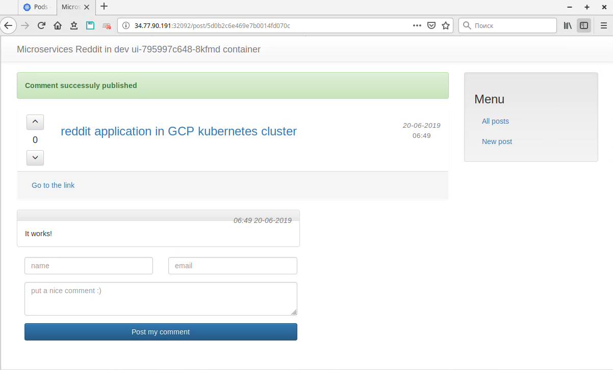
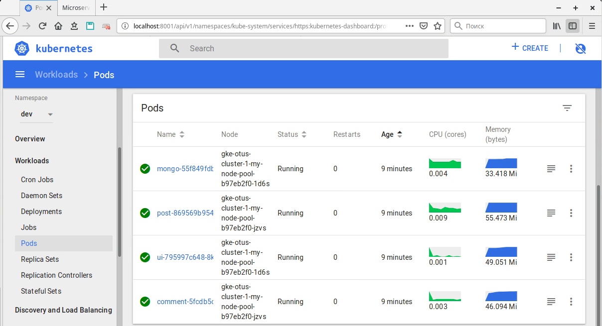

# mnsold-otus_microservices
mnsold-otus microservices repository

# ДЗ№14

- Доработана роль anasible-galaxy geerlingguy.docker до установки docker-machine

- Установлено ПО

  ```bash
  docker --version
  Docker version 18.06.3-ce, build d7080c1

  docker-compose version
  docker-compose version 1.24.0, build 0aa59064
  docker-py version: 3.7.2
  CPython version: 3.6.8
  OpenSSL version: OpenSSL 1.1.0j  20 Nov 2018

  docker-machine version
  docker-machine version 0.16.0, build 702c267f
  ```

- Запущен контейнер `docker run hello-world`

- Опробованы команды `docker ps` `docker ps -a` `docker images`

- Создали контейнер, вошли в bash `docker run -it ubuntu:16.04 /bin/bash` и создали там файл, затем создали еще один контейнер аналогичной командой, созданого файла там нет, т.к. мы не запустили ранее созданный контейнер, создали новый директивой `run`

- Запустили ранее созданный контейнер через conteqner_id командой`docker start container_id`

- Подключились к терминалу директивой `docker attach container_id` , вышли из контейнера не останавливая его `Ctrl+p`, `Ctrl+q`

- Рассмотрели парамерты команды `docker`

- Подключились к контейнеру`docker exec -it container_id bash`, с запуском нового процесса bash внутри контейнера

- Создали новый имидж с запущенного контейнера `docker commit container_id`

- Рассмотрены директивы `stop` `kill` по остановке и принудительному завершению процесса

- Рассмотрена директива `system df` по тотбражению использования дискового пространства занятого / может быть освобождено

- Рассмотрены директивы `rm` `rmi` по удалению контейнера и имиджа

ДЗ№15
# ДЗ №15

## Создание хостовой машины docker-machine в GCP

```bash
export GOOGLE_PROJECT=docker-otus-201905
```

```bash
# создать docker-machine
export GOOGLE_PROJECT=<GCP_PROJECT>
docker-machine create --driver google \
    --google-machine-image https://www.googleapis.com/compute/v1/projects/ubuntu-os-cloud/global/images/family/ubuntu-1604-lts \
    --google-machine-type n1-standard-1 \
    --google-zone europe-west1-b \
    docker-host

# список хостов docker-machine
docker-machine ls

# указать окружение хоста docker-machine c установленным docker-engine, с которым будем работать
eval $(docker-machine env docker-host)
#посмотреть какие переменные установились
set|grep DOCKER_*
DOCKER_CERT_PATH=/home/mnsold/.docker/machine/machines/docker-host
DOCKER_HOST=tcp://35.241.251.193:2376
DOCKER_MACHINE_NAME=docker-host
DOCKER_TLS_VERIFY=1


# переключиться в локальное окружение
eval $(docker-machine env --unset)
```

Проверка

```bash
docker-machine ls
NAME          ACTIVE   DRIVER   STATE     URL                         SWARM   DOCKER     ERRORS
docker-host   *        google   Running   tcp://35.241.251.193:2376           v18.09.6

echo $DOCKER_MACHINE_NAME
docker-host

docker images
REPOSITORY          TAG                 IMAGE ID            CREATED             SIZE
reddit              latest              ba6d8bfedfae        4 minutes ago       682MB

# переключаемся в локальное окружение, ничего нет, все на удаленной машине
docker images
REPOSITORY          TAG                 IMAGE ID            CREATED             SIZE
```

## Задание со *

### Создать storage сегмент

backend для хранения состояния terraform

```bash
cd /docker-monolith/infra/terraform/backend
terraform init

terraform apply
```

### Поднять пул инстансов terraform

```bash
cd docker-monolith/infra/terraform/stage
terraform init

# module.vpc временно отключен, выполнять не требуется
#terraform import module.vpc.google_compute_firewall.firewall_ssh default-allow-ssh
terraform apply
```

Пригодится:

- указать статический IP для пула инстансов

  https://stackoverflow.com/questions/46618068/deploy-gcp-instance-using-terraform-and-count-with-attached-disk

### Плейбуки ansible с динамическим инвентори

- Запустить основной плейбук, который установит питон (base.yml), докер (docker.yml), развернет приложение (deploy.yml)

```bash
cd docker-monolith/infra/ansible

ansible-playbook playbooks/main-site.yml
```

- Проверка

  Прейти по ссылке http://<terraform output http_lb_external_ip>:9292

- Примечание:

  Т.к. используется динамический инвентори, который возвращает docker-machine в GCP и которой не должны применяться плейбуки, то

  - все хосты проекта должны быть определены в инвентори
  - в плейбуках указано не применять к хостам, которые находятся не в группах `hosts: all:!ungrouped`, либо указывается конкретная кгруппа к которой требуется применять плейбук, чтобы плейбуки не применяись к docker-machine и обходили этот хост стороной

  PS: ! В последующем, точнее в ДЗ №19, отказался от `hosts: all:!ungrouped`, если нужно, чтобы ansible не выполнялся на не нужных хостах, нужно добавить ключ `-l <название группы>|<название хоста>`, в данном случае нужно использовать название группы `app`

### Образ packer'а с установленным docker

```bash
cd docker-monolith/infra/

packer build -var-file=packer/variables.json packer/docker.json
```

- Проверка

```bash
gcloud compute instances create packer-docker \
--boot-disk-size=10GB \
--image-family ubuntu-docker-base \
--image-project=docker-otus-201905 \
--machine-type=g1-small \
--tags docker-base \
--zone europe-west1-b \
--restart-on-failure


ssh appuser@<EXTERNAL_IP> -i ~/.ssh/appuser
docker --version
Docker version 18.06.3-ce, build d7080c1

gcloud compute instances delete packer-docker --zone europe-west1-b --delete-disks=all
```

Примечание:

Было замечено, что сборка может упасть с ошибкой `Unable to locate package python-minimal`, но если запустить сборку еще раз без каких либо изменений, то сборка проходит успешно, возможно этто коссяк какого-то образа и нужно зафиксировать конкретный образ для сборки, или предварительно проверить/установить некоторые репозитории типа `universe`.

# ДЗ №16

- Написаны Dockerfiles для 3 компонентов: `post-py` - сервис отвечающий за написание постов; `comment` - сервис отвечающий за написание комментариев; `ui` - веб-интерфейс, работающий с другими сервисами.

- Выполнена сборка образов и запущены приложения

Создать сеть

```
docker network create reddit
```

Сборка образов

```
docker build -t mnsoldotus/post:1.0 ./post-py
docker build -t mnsoldotus/comment:1.0 ./comment
docker build -t mnsoldotus/ui:1.0 ./ui -f ui/Dockerfile.1
```

Создать том

```
docker volume create reddit_db
```

Задание со * (стр. 15). Запуск контейнеров с др алиасами

```bash
docker kill $(docker ps -q)

docker run -d \
--network=reddit \
--network-alias=post_db_test \
--network-alias=comment_db_test \
-v reddit_db:/data/db \
mongo:latest

docker run -d \
--network=reddit \
--network-alias=post_test \
--env POST_DATABASE_HOST=post_db_test \
mnsoldotus/post:1.0

docker run -d \
--network=reddit \
--network-alias=comment_test \
--env COMMENT_DATABASE_HOST=comment_db_test \
mnsoldotus/comment:1.0

docker run -d \
--network=reddit \
--env POST_SERVICE_HOST=post_test \
--env COMMENT_SERVICE_HOST=comment_test \
-p 9292:9292 \
mnsoldotus/ui:1.0

```

- Выполнено улучшение образа `ui`:

  - Вариант 1. на основе базового образа `ubuntu:16.04` (см коммит файла `src/ui/Dockerfile`)
  - Вариант 2. на основе базового образа `alpine:3.9` (см файл `src/ui/Dockerfile)
  - Вариант 3. на основе базового образа `ruby:alpine3.9` (см файл `src/ui/Dockerfile.1`)

  Примечание: в каждом из последующих вариантов размер образа меньше чем в предыдущем варианте

#ДЗ №17

## Сети

- Рассмотрены сетевые драйверы `bridge` `host` `none`

- Созданы сети для приложений фрона и бекэнда (ui только во фронте, сервисы во фронте и бэкенде, БД только в бэкенде):

  ```bash
  docker network create back_net  --subnet=10.0.2.0/24
  docker network create front_net --subnet=10.0.1.0/24
  ```

- Созданы контейнеры в разных сетях
  ```bash
  docker run -d --network=back_net --network-alias=post_db --network-alias=comment_db  --name mongo_db mongo:latest
  docker run -d --network=back_net --network-alias=post --name post mnsoldotus/post:1.0
  docker run -d --network=back_net --network-alias=comment --name comment mnsoldotus/comment:1.0
  docker run -d --network=front_net -p 9292:9292 --name ui mnsoldotus/ui:1.0
  ```

  Выполнено онлайн подключение контейнеров к сети

  ```bash
  docker network connect front_net post
  docker network connect front_net comment
  ```

- Рассмотрены сетевые интерфейсы со стороны хостовой машины

  ```bash
  docker network ls
  brctl show <interface>
  ```

- Рассмотрены правила iptables

  Цепочки `POSTROUTING`, `DOCKER` с правилом `DNAT`, процесса `docker-proxy` слушающего tcp порт

  ```bash
   sudo iptables -nL -t nat
   ps ax | grep docker-proxy
  ```

##docker-compose

- Установлен docker-compose version 1.24.0

- Выполнен запуск проекта с использованием docker-compose

  ```bash
  docker kill $(docker ps -q)

  export USERNAME=<docker_hub_login>
  cd src
  docker-compose up -d
  ```

  Посмотреть список контейнеров `docker-compose ps`

  Проверка http://< docker-machine-ip >:9292/

- Выполнена корректировка docker-compose на множество сетей, сетевых алиасов

- Выполнена параметризация docker-compose.yml переменными, указанными в файле `src/.env` в формате `VAR=VAL`

  https://docs.docker.com/compose/env-file/

- Наименованием проекта по умолчанию является `basename` директории в которой находится `docker-compose.yml`, изменить наименование проекта можно следующими способами:

  1. Переменной `COMPOSE_PROJECT_NAME` в файле `.env`. Пример `COMPOSE_PROJECT_NAME=docker4`

  2. Опцией docker-compose `-p, --project-name NAME`. Пример `docker-compose -p docker4 up -d`

     https://docs.docker.com/compose/reference/envvars/

## Задание со *

1. Обеспечить изменение кода каждого из приложений, не выполняя сборку образа:

   Смонтировать код приложений из соответствующих директорий `comment` `post-py` `ui` в `/app` через опцию  `volumes: ...`

   Примечание: т.к. кода на docker-host нет, нужно его туда сначала скопировать, либо монтировать локальную директорию на docker-host.

   PS:

   - docker-machine mount `cd src; docker-machine mount docker-host:/app ./`, использующий SSHFS, монтирует удаленную директорию в локальную, а не оборот, в прочем как и sshfs. Не умеет монтировать в не пустую директорию и выдает ошибку: "fuse: if you are sure this is safe, use the 'nonempty' mount option".
   - т.е. нужно монтировать с использованием sshfs + ssh forwarding  (reverse sshfs ) https://superuser.com/questions/616182/how-to-mount-local-directory-to-remote-like-sshfs

2. Обеспечить запуск puma для руби приложений в дебаг режиме с двумя воркерами (флаги --debug и -w 2):

   Переопределить директиву CMD докер образов с ruby приложениями опцией `command: ...`

Результат зафиксирован в файле `src/docker-compose.override.yml`

Запустить проект

- Вариант с копированием кода на удаленную машину

```bash
cd src/
docker-machine ssh docker-host "sudo mkdir /app; sudo chown -R docker-user /app"
docker-machine scp -r -d ./ docker-host:/app/
docker-machine ssh docker-host "chmod a-x /app/post-py/*.py"
docker-compose -f docker-compose.override.yml up -d

```

- вариант с монтированием локальной директории на удаленную машину (reverse sshfs )
```bash
# создать точку монтирования
localmachine$ уdocker-machine ssh docker-host "sudo mkdir /app"
# ssh forwarding
localmachine$ ssh docker-user@$(docker-machine ip docker-host) -i ~/.docker/machine/machines/docker-host/id_rsa -R 10000:localhost:22
# mount sshfs
remotemachine$ sudo sshfs -p 10000 -o allow_other <local_user_name>@localhost:/path/to/src /app

# в соседней сессии запусть контейнеры
localmachine$ cd src/; docker-compose -f docker-compose.override.yml up -d

#------------
# закончить тест
localmachine$ docker-compose -f docker-compose.override.yml down
remotemachine$ sudo fusermount -uz /app
```

PS: файлы .py не д.б. исполняемые, иначе будет ошибка при старте контейнера `cd src/; chmod -R a-x post-py/*.py`


# ДЗ №19

## Подготовка ВМ, инсталляция GitLAB

- Создать ВМ для GitLAB

```bash
cd gitlab-infra
./gcloug-gitlab-vm-create.sh
```

- Подготовить ВМ

```bash
cd gitlab-infra/ansible

# проверить, что gce возвращает список хостов
ansible-inventory --list -i env/stage/inventory.gcp.yml

#проверить доступность хоста gitlab
ansible gitlab -m ping

#установить docker, compose, gitlab на хосте группы gitlab (можно указать конкретный хост 'gitlab-ce', все равно там 1 хост)
ansible-playbook playbooks/gitlab.yml -l 'gitlab' -vvv
```

## Работа в Gitlab

- Закрыли регистрацию пользователей

- Создали группу `homework`, и проект в ней `example`

- Добавили ориджин к проекту git'а микросервисов, запушили бранч gitlab-ci-id в gitlab

- В корне проекта создали `.gitlab-ci.yml` простым пайплайном, запушили в GitLAB, созданный пайплайн доступен в разделе пайплайнов CI/CD, но не работает пока, т.к. нет Runner'ов и находится в статусе pending

- Регистрируем Runner в настройках проекта, разделе CI/CD -> Runners,

  - В "Set up a specific Runner manually" запоминаем токен

  - На хосте с GitLAB запускаем контейнер с Runner

    ```bash
    ssh appuser@35.205.50.178 -i ~/.ssh/appuser

    docker run -d --name gitlab-runner --restart always \
    -v /srv/gitlab-runner/config:/etc/gitlab-runner \
    -v /var/run/docker.sock:/var/run/docker.sock \
    gitlab/gitlab-runner:latest

    ```

    !!! Если нужно собирать docker images:

    - контейнер gitlab-runner д.б. запущен с опцией `--privileged`

    - в файл конфигурационный файл runner вписать что он работает в привилигированном режиме

      https://docs.gitlab.com/runner/executors/docker.html#use-docker-in-docker-with-privileged-mode

      ```bash
      nano /srv/gitlab-runner/config/config.toml
      ------
      [[runners]]
        name = "my-runner"
        url = "http://35.205.50.178/"
        executor = "docker"
        ...
        [runners.docker]
          ...
          privileged = true
          ...
      ------
      ```


  - Регистрируем Runner

    ```bash
    ssh appuser@35.205.50.178 -i ~/.ssh/appuser

    docker exec -it gitlab-runner gitlab-runner register --run-untagged --locked=false
    ```

    При регистрации указываем

    ```properties
    Runtime platform                                    arch=amd64 os=linux pid=11 revision=5a147c92 version=11.11.1
    Running in system-mode.

    Please enter the gitlab-ci coordinator URL (e.g. https://gitlab.com/):
    http://35.205.50.178/
    Please enter the gitlab-ci token for this runner:
    токен, который запомнили выше
    Please enter the gitlab-ci description for this runner:
    [id_xxxxx8d2xxxxx]: my-runner
    Please enter the gitlab-ci tags for this runner (comma separated):
    linux,xenial,ubuntu,docker
    Registering runner... succeeded                     runner=xxxxxxx
    Please enter the executor: virtualbox, shell, docker-windows, docker-ssh, parallels, ssh, docker+machine, docker-ssh+machine, kubernetes, docker:
    docker
    Please enter the default Docker image (e.g. ruby:2.1):
    alpine:latest
    Runner registered successfully. Feel free to start it, but if it's running already the config should be automatically reloaded!

    ```

    В этом разделе увидим зарегистрированный Runner


- Переходим в раздел пайплайнов CI/CD, наш простой пайплайн теперь имеет статус `passed`

## Тестируем приложение

- Добавляем его в репозиторий и пушим в GitLAB (Add reddit app)

  ```bash
  git clone https://github.com/express42/reddit.git
  rm -rf ./reddit/.git
  ```

- Скорректировали файл `.gitlab-ci.yml` под приложение reddit, добавили указанный в пайплайне скрипт руби `reddit/simpletest.rb`, добавили библиотеку `gem 'rack-test'` в `reddit/Gemfile` (не знаю, зачем, не объясняется)

- После проделанных мероприятий на каждое изменение будет запускаться тест

- Пушим, смотрим на job `test_unit_job` (т.к. по сути только его и настроили пока, в остальных джобах просто указано `echo`)

- Добавили dev-окружение в pipeline, в задание deploy_dev_job (тестирование выполняется последнего коммита)

  ```yaml
    environment:
      name: dev
      url: http://dev.example.com
  ```

  После успешного теста в интерфейсе Gitlab в разделе Operations->Environments появится добавленное окружение `dev` с ссылкой

- Добавили еще 2 окружения `stage ` и `production ` с возможностью запуска по кнопке и при наличии teg'а определенного формата (например, 2.4.10). При отсутствии тега этих шагов в интерфейсе теста pipeline в GitLAB не будет.

  ```yaml
  production:
    stage: production
    when: manual
    only:
      - /^\d+\.\d+\.\d+/
    script:
      - echo 'Deploy'
    environment:
      name: production
      url: https://example.co
  ```

- Добавили динамическое окружение для каждого бранча

  ```bash
  branch review:
    stage: review
    script: echo "Deploy to $CI_ENVIRONMENT_SLUG"
    environment:
      name: branch/$CI_COMMIT_REF_NAME
      url: http://$CI_ENVIRONMENT_SLUG.example.com
    only:
      - branches
    except:
      - master
  ```

  Пригодится:

  Описание переменных CI https://docs.gitlab.com/ee/ci/variables/predefined_variables.html

  Некоторое раскрытие работы используемых переменных CI https://docs.gitlab.com/ee/ci/environments.html#example-configuration


## Задание со * (стр 48)

- Внутри проекта `example`создаем секреты для доступа на DockerHub в разделе Settings > CI / CD > Variables

- Корректируем задание build_job в pipeline этапа build  в `mnsold-otus_microservices\.gitlab-ci.yml`

  Имидж в котором будет происходить сборка должен содержать все необходимые команды (инструменты) в инструкции `script:`, поэтому в инструкции `image:` конкретного этого этапа указываем имидж `docker:stable` (или указать свой со всеми необходимыми командами).

  Директива `before_script: []` внутри этапа позволит переопределить before_script объявленный на уровне pipeline.

  Пригодится!

  Деплой через ssh https://medium.com/@codingfriend/continuous-integration-and-deployment-with-gitlab-docker-compose-and-digitalocean-6bd6196b502a

  Документация на опции GitLab CI/CD Pipeline в .gitlab-ci.yml https://docs.gitlab.com/ee/ci/yaml/

  Некоторые разъяснения в документации по использованию имиджей докера и инструкции `services:` https://docs.gitlab.com/ee/ci/docker/using_docker_images.html#what-is-a-service

  Докер в докере и наличие для этого сервиса `docker:dind` :

  1) http://qaru.site/questions/2440757/role-of-docker-in-docker-dind-service-in-gitlab-ci

  2) https://docs.gitlab.com/ce/ci/docker/using_docker_build.html#use-docker-in-docker-executor

  Докер в докере и привилегированный режим (контейнер gitlab-runner д.б. запущен с опцией `--privileged`) https://docs.gitlab.com/runner/executors/docker.html#use-docker-in-docker-with-privileged-mode


- Подготавливаем выделенный сервер для деплоя с автоматической установкой докера

  ```bash
  cd gitlab-infra/terraform/stage
  terraform init
  terraform apply
  ```

- Настраиваем Gitlab для выполнения деплоя через ssh

  Для этого создаем переменные в настройках проекта CI

  - переменную `CI_PRIVATE_KEY` с приватным ключом аналогичным `~/.ssh/appuser`
  - переменную `CI_USER` с именем пользователя
  - переменную `HOST` с IP адресом выделенного сервера

- Корректируем задание deploy_dev_job в pipeline этапа review в `mnsold-otus_microservices\.gitlab-ci.yml`

- Для проверки перейти по адресу http://IP_GCP:9292 (или нажать кнопку " View deployment" в Environments в разделе Operations проекта)


## Задание со * (стр 49)

- Автоматизация развертывания и регистрации Gitlab CI Runner

  Общая идея создания множества ранеров представлена в bash скрипте.

  В качестве некоторого завершенного решения можно завернуть скрипт в ansible, развертывание ВМ сделать в терраформ, тогда можно будет обеспечить масштабирование: нужное количество ВМ с нужным количеством ранеров в каждой ВМ.

  Чтобы совсем все было хорошо и авто масштабирование работало в полной мере, смотрим в конфиг `/etc/gitlab-runner/config.toml` и документацию Runners autoscale configuration  https://docs.gitlab.com/runner/configuration/autoscale.html

```bash
GITLAB_SERVER_URL="http://35.205.50.178/"
GITLAB_PROJECT_REGISTRATION_TOKEN="TYkzx8HKZ5MH67SAR4_y"
GITLAB_RUNNER_CONTEINER_COUNT=2
GITLAB_RUNNER_CONTEINER_PREFIX="gitlab-runner"
GITLAB_RUNNER_EXECUTOR="docker"
GITLAB_RUNNER_DOCKER_IMAGE="gitlab/gitlab-runner:latest"
GITLAB_RUNNER_TAG_LIST_COMMA="docker"

for ((i=1;i<=$GITLAB_RUNNER_CONTEINER_COUNT;i++)); do
    GITLAB_RUNNER_CONTEINER_NAME=$GITLAB_RUNNER_CONTEINER_PREFIX$i

    echo "Create container: $GITLAB_RUNNER_CONTEINER_NAME"

    sudo docker run -d --name $GITLAB_RUNNER_CONTEINER_NAME --restart always \
        -v /srv/gitlab-runner/config:/etc/gitlab-runner \
        -v /var/run/docker.sock:/var/run/docker.sock \
        gitlab/gitlab-runner:latest

    sudo docker exec -it $GITLAB_RUNNER_CONTEINER_NAME gitlab-runner register \
        --non-interactive \
        --url "$GITLAB_SERVER_URL" \
        --registration-token "$GITLAB_PROJECT_REGISTRATION_TOKEN" \
        --executor "$GITLAB_RUNNER_EXECUTOR" \
        --docker-image "$GITLAB_RUNNER_DOCKER_IMAGE" \
        --description "$GITLAB_RUNNER_CONTEINER_NAME_$GITLAB_RUNNER_EXECUTOR-runner" \
        --tag-list "$GITLAB_RUNNER_TAG_LIST_COMMA" \
        --run-untagged="true" \
        --locked="false"
done
```

Вывод скрипта:

```properties
Create container: gitlab-runner1
ca08e6342a97030c86709c2522be1c45b8cbda4c28e2311f3f25dd8fe688eaae
Runtime platform                                    arch=amd64 os=linux pid=12 revision=5a147c92 version=11.11.1
Running in system-mode.

Registering runner... succeeded                     runner=TYkzx8HK
Runner registered successfully. Feel free to start it, but if it's running already the config should be automatically reloaded!
Create container: gitlab-runner2
5cf4a73e3a516482781cc2cda9775291bf767614e494beb682cdae9d819be780
Runtime platform                                    arch=amd64 os=linux pid=12 revision=5a147c92 version=11.11.1
Running in system-mode.

Registering runner... succeeded                     runner=TYkzx8HK
Runner registered successfully. Feel free to start it, but if it's running already the config should be automatically reloaded!

```

- Интеграция Pipeline с тестовым Slack-чатом

  - В настройках проекта, разделе Integration, идем в сервис "Slack notifications"
  - Согласно предложению сервиса "Slack notifications" выполнить настройку по добавлению webhook (Add an incoming webhook), делаем это, переходим по предоставленной GitLab ссылке, добавляем конфигурацию,  выбираем канал уведомления
  - Меняем имя уведомления в поле Customize Name на Gitlab (вместо incoming-webhook)
  - Копируем полученный Webhook URL вида `https://hooks.slack.com/services/T6Hxxxxxx/...` , вставляем в сервис "Slack notifications" в поле Webhook
  - Жмем тест конфигурации, в канал прилетает уведомление
  - Активируем сервис "Slack notifications"

  Канал интеграции слаки https://devops-team-otus.slack.com/messages/CH2FT5W87


# ДЗ №20

- Создали правило фаервола для Prometheus и Puma: 

  ```bash
  gcloud compute firewall-rules create prometheus-default --allow tcp:9090
  gcloud compute firewall-rules create puma-default --allow tcp:9292
  ```

- С использованием docker-machine создали хост

  ```bash
  export GOOGLE_PROJECT=<GCP_PROJECT>
  
  docker-machine create --driver google \
    --google-machine-image https://www.googleapis.com/compute/v1/projects/ubuntu-os-cloud/global/images/family/ubuntu-1604-lts \
    --google-machine-type n1-standard-1 \
    --google-zone europe-west1-b \
    docker-host
  
  eval $(docker-machine env docker-host)
  ```

- Запускаем prometeus для начального знакомства (есть опция --rm)

  ```bash
  docker run --rm -p 9090:9090 -d --name prometheus prom/prometheus:v2.1.0
  ```


  После знакомства контейнер был удален

- Подготовили директории для последующего задания

  - созданы директории `docker/` `monitoring/`
  - в директорию `docker/ `перенесена директория `docker-monolith/`, из `src/` скопированы файлы docker-compose.yml и .env*
  - Т.к. с этого момента сборка сервисов отделена от docker-compose, инструкции build удалены из docker-compose.yml

- Подготовили и запустили простой образ prometheus со своим конигурационным файлом для сбора метрик в директории monitoring/prometheus

  ```bash
    cd monitoring/prometheus/
    docker build -t mnsoldotus/prometheus .
  ```

- Т.к. сборка образов отделена от docker-compose, сборку теперь выполняется через файлы `docker_build.sh`, размещенный в каждом сервисе директории `src/`

  ```bash
  #GitHub username
  export USER_NAME=mnsoldotus
  
  cd src/comment; ./docker_build.sh
  cd src/post-py; ./docker_build.sh
  cd src/ui; ./docker_build.sh
  
  ```

- По ДЗ поднимаем Prometheus совместно с микросервисами, для этого в файл `docker\docker-compose.yml` добавляем секцию `prometheus:` и volume к нему

- Поднимаем сервисы `docker-compose up -d`, сервис д.б. доступен по адресу `http://GCP_IP:9292`, смотрим в раздел target в prometheus, сервисы д.б. в состоянии `UP`

  ! Заметка и контекстном пути по которому собираются метрики:

  При проверке end-points в target было обнаружено, что сбор метрик в сервисах идет по пути `http://service:port/metrics`, но если посмотреть в файл `monitoring/prometheus/prometheus.yml`, то увидим, что в файле, в разделе target, определен только хост:порт, и ничего не сказано о контекстном пути, по которому доступны метрики.

- В интерфейсе prometheus посмотрели не доступность сервиса `ui`, выполнили поиск проблемы, для этого сделали: остановили сервис `post`, сервис `ui` проверят сервисы от которых зависит и метрика `ui_health` сервиса `ui` стала показывать о своей не доступности, посмотрели метрику `ui_health_post_availability` сервиса `post`, обнаружили, что сервис стал не доступен в это же время, подняли сервис `post`,  сервис `ui` так же стал доступен.

- Добавил экспортер `node-exporter` в сервисы приложения `docker/docker-compose.yml` и задание для него в  prometheus  в `monitoring/prometheus/prometheus.yml`, пересобрали докер prometheus, перезапустили сервисы

- Ссылка на докерхаб с образами https://cloud.docker.com/u/mnsoldotus/repository

  

## Задание со * (стр 49)

- Создал докер образ `mnsoldotus/prometheus_mongodb_exporter`на основе https://github.com/percona/mongodb_exporter

  ```bash
  monitoring/mongodb_exporter/docker_build.sh
  ```

- Добавил экспортер `mongodb-exporter` в сервисы приложения `docker/docker-compose.yml` и задание для него в  prometheus  в `monitoring/prometheus/prometheus.yml`, пересобрал докер prometheus, перезапустили сервисы

  ```bash
  export USER_NAME=mnsoldotus
  
  docker build -t $USER_NAME/prometheus monitoring/prometheus
  
  cd docker
  docker-compose down
  docker-compose up -d
  ```

  В таргетах prometheus появилось задание `mongodb (1/1 up)`, значения хранятся в метриках `mongodb_*`. Метрика `mongodb_up` показывает:

  ```
  Element                                                     Value
  mongodb_up{instance="mongodb-exporter:9216",job="mongodb"}	1
  ```

## Задание со * (стр 50)

- Добавил экспортер `blackbox-exporter` на основе https://github.com/prometheus/blackbox_exporter

  Сервис экпортера в файле`docker/docker-compose.yml`, задание в  prometheus  в файле `monitoring/prometheus/prometheus.yml`, пересобрал докер prometheus, перезапустил сервисы

  В таргетах prometheus появилось задание `blackbox (3/3 up)`, значения хранятся в метриках `probe_*`. Метрика `probe_http_status_code` показывает:

  ```json
  Element 	                                                            Value
  probe_http_status_code{instance="http://comment:9292",job="blackbox"}	404
  probe_http_status_code{instance="http://post:5000",job="blackbox"}	    404
  probe_http_status_code{instance="http://ui:9292",job="blackbox"}	    200
  ```

  В корне приложения `comment` и `post` ничего нет, нужно мониторить какой то контекстный путь, например `/healthcheck`, но для теста самое то, когда видно, что что-то не доступно.

  Список метрик:

  ​	probe_dns_lookup_time_seconds
  ​	probe_duration_seconds
  ​	probe_failed_due_to_regex
  ​	probe_http_content_length
  ​	probe_http_duration_seconds
  ​	probe_http_redirects
  ​	probe_http_ssl
  ​	probe_http_status_code
  ​	probe_http_version
  ​	probe_ip_protocol
  ​	probe_success

  Пригодится:

  - blackbox_exporter https://github.com/prometheus/blackbox_exporter

  - Пример использования blackbox_exporter https://rtfm.co.ua/prometheus-alertmanager-i-blackbox-exporter-proverka-sroka-dejstviya-ssl-i-notifikaciya-v-slack/

  - Пример использования blackbox_exporter  https://medium.com/the-telegraph-engineering/how-prometheus-and-the-blackbox-exporter-makes-monitoring-microservice-endpoints-easy-and-free-of-a986078912ee

## Задание со * (стр 51)

- Добавлен Makefile

  ```bash
  cd docker
  
  # собрать и запушить образ, на примере образа prometheus
  make docker-build-prometheus
  make docker-push-prometheus
  
  # собрать и запушить все образы
  make all
  ```

# ДЗ №21

- Вынесли правила мониторинга в файл `docker/docker-compose-monitoring.yml`

- Создали правило фаервола для cAdvisor: 

  ```bash
  gcloud compute firewall-rules create cadviser-default --allow tcp:8080
  ```
  
- С использованием docker-machine создали хост

  ```bash
  export GOOGLE_PROJECT=<GCP_PROJECT>
  
  docker-machine create --driver google \
    --google-machine-image https://www.googleapis.com/compute/v1/projects/ubuntu-os-cloud/global/images/family/ubuntu-1604-lts \
    --google-machine-type n1-standard-1 \
    --google-zone europe-west1-b \
    docker-host
  
    eval $(docker-machine env docker-host)
  
  ```
  
- Добавили мониторинг контейнеров с помощью cAdvisor (файлы `docker/docker-compose-monitoring.yml` `monitoring/prometheus/prometheus.yml`, пересобрали образ prometheus 

  ```bash
  cd docker
  make docker-build-prometheus
  ```

- Запустили проект

  ```bash
  cd docker
  docker-compose up -d
  docker-compose -f docker-compose-monitoring.yml up -d
  ```
  
- Исследовали интерфейс cAdvisor, увидели, что cAdvisor по пути `/metrics` предоставляет метрики в формате prometheus и начинаются они с `container_`, посмотрели метрики c cAdvisor в prometheus

- Добавили сервис Grafana в `docker/docker-compose-monitoring.yml`

  ```bash
  gcloud compute firewall-rules create grafana-default --allow tcp:3000
  
  cd docker
  docker-compose -f docker-compose-monitoring.yml up -d grafana
  ```

- В grafana сделали:

  - добавили источник типа ` Prometheus` 
  
  - на сайте выбрали наиболее популярный дашбоард для datasource=prometheus & category=docker, выбор пал на этот дашбоард https://grafana.com/dashboards/893 , сохранили с сайта json дашбоадра в `monitoring/grafana/dashboards/DockerMonitoring.json`
  
  - импортировали дашбоард из сохраненного json файла
  
  - Создали дашбоард UI_service_monitoring, добавили в него графики, использовали функции `rate ` и `histogram_quantile`
  
    ```properties
    # UI HTTP Requsts
    rate(ui_request_count[1m])
    
    # Rate of UI HTTP Requests with Error
    rate(ui_request_count{http_status=~"^[45].*"}[1m])
    ```
  
    Добавили график 95-й процентиль выборки времени обработки запросов
  
    ```properties
    histogram_quantile(0.95, sum(rate(ui_request_response_time_bucket[5m])) by (le))
    ```
  
  - Создали дашбоард Business_Logic_Monitoring, добавили в него графики
  
    ```properties
    # Post count
    rate(post_count[1h])
    
    # Comment count
    rate(comment_count[1h])
    ```
  
- Настройка оповещений в prometheus (alertmanager)

  - Добавили в prometheus компонент alertmanager из образа ` prom/alertmanager:v0.14.0`
  - Настроили Incoming  Webhook для отправки алертов в канал слаки https://devops-team-otus.slack.com/apps/A0F7XDUAZ-incoming-webhooks?page=1
  - Добавили конфиг  `monitoring/alertmanager/config.yml` со slack-notifications
  - Добавили сервис `alertmanager` в `docker/docker-compose-monitoring.yml`
  - Собрали образ `make docker-build-alertmanager`


## Задание со *

**Добавить в Makefile сборку и публикацию сервисов этого ДЗ**

Добавлено `docker-build-alertmanager` `docker-push-alertmanager`

**Сбор метрик с Docker в формате Prometheus с использованием экспериментальной опции**

https://docs.docker.com/config/thirdparty/prometheus/

- Включаем опцию в докер

  ```bash
docker-machine ssh docker-host
  
  sudo nano /etc/docker/daemon.json
  --------------------------------
  {
    "metrics-addr" : "0.0.0.0:9323",
    "experimental" : true
  }
  --------------------------------
  sudo systemctl restart docker
  ```
  
- Добавили задание `docker` в файл `monitoring/prometheus/prometheus.yml` (из контейнера обращаемся по имени сервера докер-хоста), пересобрали образ `cd cd docker; make docker-build-prometheus`

- Поднимаем сервисы

  ```bash
  cd docker
  docker-compose up -d
  docker-compose -f docker-compose-monitoring.yml up -d
  ```
  
- В интерфейсе prometheus появятся метрики`engine_daemon_`

  По количеству и главное по составу, сильно уступает метрикам cAdvisor (начинаются с `container_`).

  В качестве дашборда можно попробовать Docker Engine Metrics (ID=1229) https://grafana.com/dashboards/1229

**Сбор метрик с Docker в формате Prometheus с использованием Telegraf**

https://hub.docker.com/_/telegraf

https://github.com/influxdata/telegraf/tree/master/plugins/inputs/docker

https://github.com/influxdata/telegraf/tree/master/plugins/outputs/prometheus_client

- Подготовлен образ Telegraf `monitoring/telegraf`  на основе официального образа `telegraf:1.10.4` c плагинами `outputs.prometheus_client`  и `inputs.docker` описанными в конфигурационном файле `monitoring/telegraf/telegraf.conf`

- В `docker/docker-compose-monitoring.yml` добавлен сервис `telegraf`

- В `monitoring/prometheus/prometheus.yml` добавлено задание `telegraf` для сбора метрик

- Поднимаем сервисы

  ```bash
  cd docker
  docker-compose up -d
  docker-compose -f docker-compose-monitoring.yml up -d
  ```
  
- В интерфейсе prometheus появятся метрики`docker_container_` `docker_n_`, весь перечень метрик доступен по ссылке https://github.com/influxdata/telegraf/tree/master/plugins/inputs/docker

  Количество метрик значительно больше чем в cAdvisor. Готовых дашбордов к Grafana для Telegraf:Docker от источника Prometheus нет, есть только от источника InfluxDB.


# ДЗ №23

##Подготовительные мероприятия для ДЗ

- Для этого ДЗ обновлен код приложения reddit в директории src/ из https://github.com/express42/reddit/tree/logging бранч=logging

- У приложения reddit изменен тэг c `1.0` на `logging`

- Собраны новые образы

  ```bash
  cd docker
  make \
  docker-build-comment docker-push-comment \
  docker-build-post docker-push-post \
  docker-build-ui docker-push-ui
  ```

- Создана докер машина `logging`

  ```bash
  docker-machine create --driver google \
  --google-machine-image https://www.googleapis.com/compute/v1/projects/ubuntu-os-cloud/global/images/family/ubuntu-1604-lts \
  --google-machine-type n1-standard-1 \
  --google-open-port 5601/tcp \
  --google-open-port 9292/tcp \
  --google-open-port 9411/tcp \
  logging
  
  # configure local env
  eval $(docker-machine env logging)
  
  # узнаем IP адрес
  docker-machine ip logging
  ```

##Создание сервисов для логирования

- Описали сервисы fluentd, elasticsearch, kibana в файле`docker/docker-compose-logging.yml`

- Подготовили образ fluend со своим конфигурационным файлом в директории `logging\fluentd`, собрали образ

  ```bash
  cd docker
  make docker-build-fluentd docker-push-fluentd
  ```

- Запускаем сервисы приложения, делаем в веб-интерфейсе посты и смотрим логи

  ```bash
  cd docker
  docker-compose up -d
  
  #просмотра логов post сервиса
  docker-compose logs -f post
  ```

  Временно игнорируем ошибки по доступности Zipkin, т.к. он пока не установлен.

- Поднимем сервисы логирования
  Сначала делаем fix для elasticsearch чтоб работал, а не умирал:

  ```bash
  ssh docker-user@$(docker-machine ip logging) -i ~/.docker/machine/machines/logging/id_rsa
  sudo sysctl -w vm.max_map_count=262144
  exit
  ```
  ```bash
  cd docker
  docker-compose -f docker-compose-logging.yml up -d
  ```

##Работа с логами

###Структурированные логи в формате json

- Добавили сбор логов сервиса POSTв fluentd в файл `docker/docker-compose.yml`, перезапустили сервис

  ```bash
  docker-compose stop post
  docker-compose rm post
  docker-compose up -d
  ```

- В интерфейсе Kibana создали индекс `fluentd-*` в Management - Kibana - Index Patterns

- Поработали в Kibana в разделе Discover, наложили фильтры (по событию/по событиям конкретного контейнера), посмотрели на список полей логов

- В одно из полей, в поле log, информация пишется в структурированном виде в формате json:

  ```json
  {"addr": "192.168.96.2", "event": "request", "level": "info", "method": "GET", "path": "/healthcheck?", "request_id": null, "response_status": 200, "service": "post", "timestamp": "2019-06-11 18:40:12"}
  ```

- В конфигурацию fluentd `logging/fluentd/fluent.conf` добавили фильтр `<filter service.post>` для поля log в формате json, пересобрали образ и перезапустили fluentd

  ```bash
  cd docker
  make docker-build-fluentd docker-push-fluentd
  docker-compose -f docker-compose-logging.yml up -d fluentd
  ```

- Добавили несколько постов, увидели, что одно поле log, которое было в формате json, разобралось на несколько полей, выполнили поиск по одному из полей в формате `имя_поля: ключевое_слово`

  ```properties
  "addr": "192.168.96.2",
  "event": "request",
  "level": "info",
  "method": "GET",
  "path": "/healthcheck?",
  "request_id": "ee1fb775-beef-4759-9a50-cd2a23018e0c",
  "response_status": 200,
  "service": "post",
  "timestamp": "2019-06-11 21:59:13",
  "@timestamp": "2019-06-11T21:59:13+00:00",
  "@log_name": "service.post"
  ```

  

### Не структурированные логи

####regexp

- Добавили сбор логов сервиса UI в fluentd в файл `docker/docker-compose.yml`, перезапустили сервис

  ```bash
  docker-compose stop ui
  docker-compose rm ui
  docker-compose up -d
  ```

- В одно из полей, в поле log, информация пишется в относительно не структурированном виде:

  ```
  I, [2019-06-11T22:07:53.325818 #1]  INFO -- : service=ui | event=request | path=/ | request_id=ac893ced-abb1-4738-baa2-1ecda66c1ee2 | remote_addr=1.1.1.1 | method= GET | response_status=200
  ```

- В конфигурацию fluentd `logging/fluentd/fluent.conf` добавили фильтр `<filter service.ui>` для поля log в не структурированном формате, пересобрали образ и перезапустили fluentd

  ```bash
  cd docker
  make docker-build-fluentd docker-push-fluentd
  docker-compose -f docker-compose-logging.yml up -d fluentd
  ```
- Поле log в неструктурированном формате разобралось на несколько полей

  ```properties
  "level": "INFO",
  "user": "--",
  "service": "ui",
  "event": "request",
  "path": "/",
  "request_id": "75d32c24-c039-41e4-b8af-153a72567633",
  "remote_addr": "1.1.1.1",
  "method": "GET",
  "response_status": "200",
  "@timestamp": "2019-06-11T22:13:13+00:00",
  "@log_name": "service.ui"
  ```


#### grok template

Список типов grok полей: https://github.com/elastic/logstash/blob/v1.4.0/patterns/grok-patterns

Использование нескольких шаблонов для разбора поля https://www.rubydoc.info/gems/fluent-plugin-grok-parser/2.0.0

Онлайн тест шаблона: https://grokdebug.herokuapp.com/

- Заменили в конфигурации fluentd `logging/fluentd/fluent.conf` фильтр `<filter service.ui>` на несколько grok шаблонов для разбора логов, пересобрали образ и перезапустили fluentd

- Поле message в неструктурированном формате разобралось на несколько полей

  ```properties
  "service": "ui",
  "event": "request",
  "path": "/new",
  "request_id": "cec3f2d6-0e6b-426a-bf0b-814fd0e48c77",
  "remote_addr": "1.1.1.1",
  "method": " GET",
  "response_status": "200",
  "@timestamp": "2019-06-11T23:10:14+00:00",
  "@log_name": "service.ui"
  ```

  !!! Это один из примеров вывода, сервис ui пишет в нескольких форматах, для разбора всех форматов вывода применено несколько подряд идущих grok шаблонов `<filter service.ui>` `<filter service.ui>` , причем в последнем указано несколько pattern для разбора поля message.

  **Задание со * (стр 43)**

  ```xml
  <filter service.ui>
    @type parser
    format grok
    <grok>
      pattern <шаблон_разбора_поля_1>
    </grok>
    <grok>
      pattern <шаблон_разбора__поля_2>
    </grok>
    <grok>
      pattern %{GREEDYDATA:message}  <--если_не_подошли_шаблоны_выше
    </grok>
    key_name message
  </filter>
  ```
  
  `reserve_data yes` - важно, если не указано, весь объект строки журнала заменяется только свойствами, извлеченными из `format`, поэтому, если у вас уже есть другие свойства, такие как те, которые добавлены фильтром `kubernetes_metadata`, они удаляются, если не добавить параметр `reserve_data`. Думаю, что вариант представленный выше с последним pattern, должен решить проблему указания данной опции.

### Распределенный трейсинг (Zipkin)

- Добавили сервис zipkin в `docker/docker-compose-logging.yml`

- Включили в каждом приложении поддержку zipkin в `docker/docker-compose.yml`

- Перезапустим приложения и сервисы

  ```bash
  cd docker
  docker-compose -f docker-compose-logging.yml -f docker-compose.yml down
  docker-compose -f docker-compose-logging.yml -f docker-compose.yml up -d
  ```

- После того как поработали в приложениях, в zipkin `http://< IP >:9411/` появились записи от приложения

**Задание со * (стр 53)**

- Для успешной сборки приложения нужно

  - в `docker_build.sh` добавить тег `logging` к образу
  - в `Dockerfile` сервисов ui/comment перед инструкцией `RUN apt-get update ...` добавить инструкцию `RUN sed '/jessie-updates/s/^/# /' -i /etc/apt/sources.list`, иначе образ не собирается
  
- Описание выявленной проблемы с использованием Zipkin:

  При нажатии на пост, приложение выдает ошибку: Can't show comments, some problems with the comment service.

  Zipkin сообщает о статусе `http.status=500` в span'e операции comment на запрос get.


# ДЗ№25

- Созданы файлы с Deployment манифестами приложений ui/post/comment/mongo в `kubernetes/reddit`

- Пройдено руководство по настройке kubernetes:

  Kubernetes The Hard Way https://github.com/kelseyhightower/kubernetes-the-hard-way

  Процесс выполнения отмечен в файле`kubernetes-the-hard-way-tutorial/MY_EXECUTION_GUIDE.md`

- Выполнен запуск приложений
```bash
cd kubernetes/reddit

kubectl apply -f comment-deployment.yml
kubectl apply -f mongo-deployment.yml
kubectl apply -f post-deployment.yml
kubectl apply -f ui-deployment.yml
```
- Проверка показала успешный запуск
```bash
kubectl get pods -n default|grep -iE "ui|post|comment|mongo|name"

NAME                                  READY   STATUS    RESTARTS   AGE
comment-deployment-7f6d74b44f-bq5rg   1/1     Running   0          61s
mongo-deployment-67f58fb89-dxc4n      1/1     Running   0          61s
post-deployment-7bbd85f579-978bw      1/1     Running   0          61s
ui-deployment-bffdc68c5-nf5tt         1/1     Running   0          75s
```

Пригодится:
Разбор сети https://habr.com/ru/company/flant/blog/420813/


# ДЗ №26

##minikube

- kubectl была установлена ранее

  ```bash
  kubectl version
  Client Version: version.Info{Major:"1", Minor:"12", GitVersion:"v1.12.0", GitCommit:"0ed33881dc4355495f623c6f22e7dd0b7632b7c0", GitTreeState:"clean", BuildDate:"2018-09-27T17:05:32Z", GoVersion:"go1.10.4", Compiler:"gc", Platform:"linux/amd64"}
  ```

- Установлен mimikube, руководство https://kubernetes.io/docs/tasks/tools/install-minikube/

- Запуск minikube

  ```bash
  #ранее был установлен докер
  docker -v
  Docker version 18.06.3-ce, build d7080c1
  ```

  > Выполнить перед запуском minikube, либо запустить, убедиться в проблеме, удалить  `sudo minikube delete` и запустить повторно
  >
  > Проблема:
  >
  > Контейнеры с CoreDNS падают с ошибкой
  >
  > ```bash
  > docker logs 2de7ba14078a
  > 
  > ...
  > 2019/06/15 22:34:44 [FATAL] plugin/loop: Seen "HINFO IN 6780840038128557085.1982390448653738826." more than twice, loop detected
  > ```
  >
  > Решение 1:
  >
  > https://github.com/kubernetes/minikube/issues/3511
  >
  > ```bash
  > #Добавить опцию к старту minikube
  > --extra-config=kubelet.resolv-conf=/run/systemd/resolve/resolv.conf
  > ```
  >
  > Решение 2:
  >
  > https://github.com/kubernetes/minikube/issues/3511
  >
  > ```bash
  > sudo apt-get install dnsmasq
  > sudo systemctl stop systemd-resolved
  > sudo systemctl disable systemd-resolved
  > 
  > sudo nano /etc/NetworkManager/NetworkManager.conf
  > # add under [main]
  > dns=dnsmasq
  > 
  > sudo cp /etc/resolv.conf /etc/resolv.conf.bak
  > sudo rm /etc/resolv.conf; sudo ln -s /var/run/NetworkManager/resolv.conf /etc/resolv.conf
  > 
  > sudo systemctl start dnsmasq
  > sudo systemctl restart NetworkManager
  > 
  > #----------
  > #обратные действия
  > sudo systemctl stop dnsmasq
  > sudo systemctl disable dnsmasq
  > 
  > sudo nano /etc/NetworkManager/NetworkManager.conf
  > # comment/delete under [main]
  > #dns=dnsmasq
  > 
  > sudo rm /etc/resolv.conf
  > sudo mv /etc/resolv.conf.bak /etc/resolv.conf
  > 
  > sudo systemctl start systemd-resolved
  > sudo systemctl enable systemd-resolved
  > sudo systemctl restart NetworkManager
  > ```

  Запуск в docker, вместо virtualbox:

  ```bash
  ./kubernetes/minikubectl.sh start
  
  ```

  Чтобы выполнять kubectl не рутом, в `kubernetes/minikubectl.sh` по рекомендации из вывода запуска minikube добавлено:

  ```bash
  sudo chown -R $USER $HOME/.kube $HOME/.minikube
  ```

  

  > Проблема:
  >
  > Когда я деплоил приложения, мой миникуб умирал на глазах, выглядело это по разному, от статусов контейнеров в "evicted", до получения ошибки: The connection to the server 192.168.1.138:8443 was refused - did you specify the right host or port?
  >
  > По умолчанию, minikuve запускается с такими параметрами:
  >
  > ```rst
  > Creating none VM (CPUs=2, Memory=2048MB, Disk=20000MB) ...
  > ```
  >
  > И у меня было 2-3свободных ГБ на HDD,.
  >
  > Решение:
  >
  > Накинул несколько ГБ HDD (хотя не уверен, что именно в этом была проблема, т.к. не видел, что упираюсь в него.)
  >
  > Только после явного указания ресурсов, приложения задеплоились и миникуб не умер.
  >
  > ```bash
  > #параметры запуска лучше посмотреть  kubernetes/minikubectl.sh, но примерно они были такие:
  > sudo minikube start --kubernetes-version v1.12.0 --vm-driver none --extra-config=kubelet.resolv-conf=/run/systemd/resolve/resolv.conf --cpus 2 --memory 4096
  > ```

  Вывод

  ```rst
  * Relaunching Kubernetes v1.12.0 using kubeadm ...
  * Configuring local host environment ...
  
  ! The 'none' driver provides limited isolation and may reduce system security and reliability.
  ! For more information, see:
    - https://github.com/kubernetes/minikube/blob/master/docs/vmdriver-none.md
  
  ! kubectl and minikube configuration will be stored in /home/username
  ! To use kubectl or minikube commands as your own user, you may
  ! need to relocate them. For example, to overwrite your own settings:
  
    - sudo mv /home/username/.kube /home/username/.minikube $HOME
    - sudo chown -R $USER $HOME/.kube $HOME/.minikube
  
  * This can also be done automatically by setting the env var CHANGE_MINIKUBE_NONE_USER=true
  * Verifying: apiserver proxy etcd scheduler controller dns
  * Done! kubectl is now configured to use "minikube"
  
  ```

  

  ```bash
  docker ps -a --format "table {{.Image}}\\t{{.Command}}\\t{{.Status}}\\t{{.Names}}"
  IMAGE                  COMMAND                  STATUS  NAMES
  4689081edb10           "/storage-provisioner"   Up...   k8s_storage-provisioner_storage-provisioner_kube-system_...
  k8s.gcr.io/pause:3.1   "/pause"                 Up...   k8s_POD_storage-provisioner_kube-system_...
  367cdc8433a4           "/coredns -conf /etc…"   Up...   k8s_coredns_coredns-576cbf47c7-d5x68_kube-system_...
  367cdc8433a4           "/coredns -conf /etc…"   Up...   k8s_coredns_coredns-576cbf47c7-sqgtf_kube-system_...
  k8s.gcr.io/pause:3.1   "/pause"                 Up...   k8s_POD_coredns-576cbf47c7-d5x68_kube-system_...
  k8s.gcr.io/pause:3.1   "/pause"                 Up...   k8s_POD_coredns-576cbf47c7-sqgtf_kube-system_...
  9c3a9d3f09a0           "/usr/local/bin/kube…"   Up...   k8s_kube-proxy_kube-proxy-ql42x_kube-system_...
  k8s.gcr.io/pause:3.1   "/pause"                 Up...   k8s_POD_kube-proxy-ql42x_kube-system_...
  3cab8e1b9802           "etcd --advertise-cl…"   Up...   k8s_etcd_etcd-minikube_kube-system_...
  5a1527e735da           "kube-scheduler --ad…"   Up...   k8s_kube-scheduler_kube-scheduler-minikube_kube-system_...
  ab60b017e34f           "kube-apiserver --au…"   Up...   k8s_kube-apiserver_kube-apiserver-minikube_kube-system_...
  119701e77cbc           "/opt/kube-addons.sh"    Up...   k8s_kube-addon-manager_kube-addon-manager-minikube_kube-system_...
  k8s.gcr.io/pause:3.1   "/pause"                 Up...   k8s_POD_kube-apiserver-minikube_kube-system_...
  k8s.gcr.io/pause:3.1   "/pause"                 Up...   k8s_POD_etcd-minikube_kube-system_...
  k8s.gcr.io/pause:3.1   "/pause"                 Up...   k8s_POD_kube-addon-manager-minikube_kube-system_...
  k8s.gcr.io/pause:3.1   "/pause"                 Up...   k8s_POD_kube-scheduler-minikube_kube-system_...
  07e068033cf2           "kube-controller-man…"   Up...   k8s_kube-controller-manager_kube-controller-manager-minikube_kube-system_...
  k8s.gcr.io/pause:3.1   "/pause"                 Up...   k8s_POD_kube-controller-manager-minikube_kube-system_...
  ```

  ```bash
  kubectl get nodes
  NAME       STATUS   ROLES    AGE   VERSION
  minikube   Ready    <none>   86m   v1.12.0
  
  kubectl get services
  NAME         TYPE        CLUSTER-IP   EXTERNAL-IP   PORT(S)   AGE
  kubernetes   ClusterIP   10.96.0.1    <none>        443/TCP   4m19s
  ```

- Конфигурация kubectl, контекст подключения=кластер + пользователь [+ неймспейс]

  Контексты хранятся в манифесте в виде yml файла ` ~/.kube/config`

  ```bash
  #Список контекстов
  kubectl config get-contexts
  
  #Текущий контекст
  kubectl config current-context
  
  #Переключение на контекст
  kubectl config use-context minikube
  ```

- Деплой приложения `ui`

  Корректируем описание деплоя `kubernetes/reddit/ui-deployment.yml`

  ```bash
  kubectl apply -f kubernetes/reddit/ui-deployment.yml
  
  kubectl get deployment
  NAME   DESIRED   CURRENT   UP-TO-DATE   AVAILABLE   AGE
  ui     3         3         3            3           18s
  
  ```

- Проброс порта с пода приложения на локальную машину

  ```bash
  #ищем приложение
  kubectl get pods --selector component=ui
  NAME                  READY   STATUS    RESTARTS   AGE
  ui-59966bfd6d-dhn64   1/1     Running   0          12m
  ui-59966bfd6d-v8jpk   1/1     Running   0          12m
  
  #пробрасываем порт
  kubectl port-forward ui-59966bfd6d-dhn64 8080:9292
  Forwarding from 127.0.0.1:8080 -> 9292
  Forwarding from [::1]:8080 -> 9292
  
  ```
  

Результат по адресу http://localhost:8080

> Ошибка:
>
> `unable to do port forwarding: socat not found.`
>
> Исправление:
>
> `sudo apt install socat`

- Деплой приложений `post` `comment`  и базы `mongo`

  Корректируем описание деплоя `kubernetes/reddit/{post|comment|mongo}-deployment.yml` и запускаем

  ```bash
  kubectl apply -f kubernetes/reddit/mongo-deployment.yml
  kubectl apply -f kubernetes/reddit/comment-deployment.yml
  kubectl apply -f kubernetes/reddit/post-deployment.yml
  
  #или все сразу
  kubectl apply -f kubernetes/reddit/
  #вывод
  deployment.apps/comment created
  deployment.apps/mongo created
  deployment.apps/post created
  deployment.apps/ui unchanged
  
  kubectl get pods --selector app=reddit
  NAME                     READY   STATUS    RESTARTS   AGE
  comment-757758-nw8zs     1/1     Running   0          12m
  comment-757758-qrj4g     1/1     Running   0          12m
  mongo-784488d64b-c7rsw   1/1     Running   0          12m
  post-5cf595cb8d-t288v    1/1     Running   0          12m
  post-5cf595cb8d-xzvzf    1/1     Running   0          12m
  ui-59966bfd6d-dhn64      1/1     Running   0          12m
  ui-59966bfd6d-v8jpk      1/1     Running   0          12m
  
  ```
  
  Для проверки, последовательно пробрасываем порты аналогично приложению ui и проверяем доступность по адресу http://localhost:8080/healthcheck
  
```bash
kubectl port-forward comment-757758-nw8zs 8080:9292
kubectl port-forward post-5cf595cb8d-xzvzf 8080:5000
```

- Добавили сервисы к приложениям `kubernetes/reddit/{comment|post|mongo}-service.yml`

  Сервисы нужны чтобы знать как к их найти. Например, при обращении на адрес post:9292 изнутри любого из POD-ов текущего namespace нас переправит на 9292-ный порт одного из POD-ов приложения post, выбранных по label-ам.

  Применяем сервисы

  ```bash
  kubectl apply -f kubernetes/reddit/comment-service.yml
  kubectl apply -f kubernetes/reddit/post-service.yml
  kubectl apply -f kubernetes/reddit/mongodb-service.yml
  
  
  kubectl get services
  NAME         TYPE        CLUSTER-IP      EXTERNAL-IP   PORT(S)     AGE
  comment      ClusterIP   10.103.112.32   <none>        9292/TCP    25s
  kubernetes   ClusterIP   10.96.0.1       <none>        443/TCP     154m
  mongodb      ClusterIP   10.97.71.87     <none>        27017/TCP   12s
  post         ClusterIP   10.109.191.26   <none>        5000/TCP    18s
  
  ```

- Добавили сервисы coomment-db  post-db (в кубере нет алиасов, поэтому это через сервисы)

  - В сервисах `kubernetes/reddit/comment-mongodb-service.yml` и `kubernetes/reddit/post-mongodb-service.yml` - добавлены дополнительные метки, чтобы отличать их от сервиса mongo
  - В деплойменте mongo `kubernetes/reddit/mongo-deployment.yml` добавили эти же метки.
  - В деплойментах `kubernetes/reddit/post-deployment.yml` и `kubernetes/reddit/comment-deployment.yml` добавили переменную окружения на БД, которая соответствует метке сервиса в метаданных.

- Делаем проверку работоспособности приложения: работает!

  ```bash
  kubectl port-forward ui-59966bfd6d-dhn64 8080:9292
  ```

  Идем на http://localhost:8080/

  Ошибки в приложении нет, поста и комментарии создаются!

  В целом, сервис mongodb не нужен, т.к. на него ничего не ссылается и его можно удалить, тоже все будет работать:

  ```bash
  kubectl delete service mongodb
  ```

  Либо можно удалить `*-mongodb-service.yml` и оставить только `mongodb-service.yml` и прописать это базу в в окружении приложения.

- Добавили сервис для ui в файл `kubernetes/reddit/ui-service.yml` с типом NodePort

  NodePort - для доступа снаружи кластера в диапазоне 30000-32767
  port - для доступа к сервису изнутри кластера

  Применяем

  ```bash
  kubectl apply -f kubernetes/reddit/
  
  kubectl get services
  NAME         TYPE        CLUSTER-IP      EXTERNAL-IP   PORT(S)          AGE
  mongodb      ClusterIP   10.98.204.109   <none>        27017/TCP        2m20s
  ui           NodePort    10.99.194.169   <none>        9292:32092/TCP   2m19s
  ...
  
  ```

  Теперь можно обратиться к приложению по сети http://192.168.1.138:32092/

- Список сервисов через команду `minikube`

  ```bash
  minikube service list
  |-------------|------------|----------------------------|
  |  NAMESPACE  |    NAME    |            URL             |
  |-------------|------------|----------------------------|
  | default     | comment    | No node port               |
  | default     | comment-db | No node port               |
  | default     | kubernetes | No node port               |
  | default     | mongodb    | No node port               |
  | default     | post       | No node port               |
  | default     | post-db    | No node port               |
  | default     | ui         | http://192.168.1.138:32092 |
  | kube-system | kube-dns   | No node port               |
  |-------------|------------|----------------------------|
  
  # перебросит в браузер на http://192.168.1.138:32092 
  minikube service ui
  ```

- Расширения (addons) для Kubernetes в minikube

  ```bash
  # список аддонов
  minikube addons list
  - addon-manager: enabled
  - dashboard: disabled
  - default-storageclass: enabled
  - efk: disabled
  - freshpod: disabled
  - gvisor: disabled
  - heapster: disabled
  - ingress: disabled
  - logviewer: disabled
  - metrics-server: disabled
  - nvidia-driver-installer: disabled
  - nvidia-gpu-device-plugin: disabled
  - registry: disabled
  - registry-creds: disabled
  - storage-provisioner: enabled
  - storage-provisioner-gluster: disabled
  
  ```

- Установим аддон dashboard

  В новых версиях по умолчанию включен, в нашей версии он еще не включен, включим его

  ```bash
  sudo minikube addons enable dashboard
  minikube addons open dashboard
  
  minikube addons list|grep dashboard
  - dashboard: enabled
  
  # все объекты kubernetes-dashboard 
  kubectl get all --all-namespaces --selector app=kubernetes-dashboard
  NAMESPACE     NAME                                        READY   STATUS    RESTARTS   AGE
  kube-system   pod/kubernetes-dashboard-776c455d65-m5hhn   1/1     Running   0          10m
  
  NAMESPACE     NAME                           TYPE        CLUSTER-IP     EXTERNAL-IP   PORT(S)   AGE
  kube-system   service/kubernetes-dashboard   ClusterIP   10.107.90.26   <none>        80/TCP    10m
  
  NAMESPACE     NAME                                              DESIRED   CURRENT   READY   AGE
  kube-system   replicaset.apps/kubernetes-dashboard-776c455d65   1         1         1       10m
  
  ```

  Перейдем в dashboard, т.к. `minikube service list` не знает url для сервиса `kubernetes-dashboard`, выполнять `minikube service kubernetes-dashboard -n kube-system` нет смысла, воспользуемся `kubectl port-forward ...`

  ```bash
  kubectl port-forward service/kubernetes-dashboard -n=kube-system 8080:80
  ```

  Переходим по ссылке http://localhost:8080/

- Добавляем namespace dev в `kubernetes/reddit/dev-namespace.yml`

  Применяем

  ```bash
  kubectl apply -f kubernetes/reddit/dev-namespace.yml
  ```

  Разворачиваем приложение в неймспейсе dev

  ```bash
   # Предварительно удалим ui-сервис, чтобы не было конфликта по nodePort: 32092
   # либо нужно удалить зафиксированный NodePort, тогда назначится произвольный из диапазона
   kubectl delete -f kubernetes/reddit/ui-service.yml
   
   kubectl apply -n dev -f kubernetes/reddit
  ```

  Результат http://nework_ip:32092/

  Добавляем в на страницу приложения UI информацию о том, в каком неймспейсе оно работает, добавляем спецификацию `env` в `kubernetes/reddit/ui-deployment.yml`  дл извлечений неймпейса из метаданных

  Редеплой

  ```bash
  kubectl apply -n dev -f kubernetes/reddit/ui-deployment.yml
  ```

  Переходим http://192.168.1.138:32092/

  Вверху приложения будет написано "Microservices Reddit **in dev** ui-795997c648-2k2fl container"

##Кластер kubernetes в GKE

  - Создали не большой кластер из 2х нод

  - Настроили доступ к кластеру с лок машины с использованием gcloud

    > bash команда формируется в GKE при нажатии кнопки Подключиться справа у названия кластера

    ```bash
    gcloud container clusters get-credentials cluster-1 --zone europe-west1-c --project docker-otus-201905
    
    # проверяем
    kubectl config current-context
    gke_docker-otus-201905_europe-west1-c_cluster-1
    
    ```

  - Разворачиваем приложение

    ```bash
    #создаем неймспейс
    kubectl apply -f kubernetes/reddit/dev-namespace.yml
    
    #разворачиваем приложение
    kubectl apply -f kubernetes/reddit/ -n dev
    
    #открываем доступ к приложениям в kubernetes
    gcloud compute firewall-rules create kubernetes-default --source-ranges=0.0.0.0/0 --allow tcp:30000-32767
    
    #определяем внешний IP рабочих нод
    kubectl get nodes -o wide
    
    #определяем порт сервиса ui
    kubectl describe service ui -n dev | grep NodePort
    ```

    Переходим в приложение http://<node-ip>:<NodePort>

    

    

  - Включаем dashboard

    Включаем Дополнение в GKE нашего кластера (Изменить там дополнения и включаем нужное).

    Для нормальной работы dashboard необходимо выдать права serviceaccount'у на просмотр информации о кластере. Роль cluster-admin  имеет полный доступ ко всем объектам кластера, назначим ее:

    ```bash
    kubectl create clusterrolebinding kubernetes-dashboard --clusterrole=cluster-admin --serviceaccount=kube-system:kubernetes-dashboard
    ```

    > В противном случае в Overview dashboard  будут ошибки типа: "configmaps is forbidden"

    Получаем доступ:

    ```bash
    kubectl proxy
    ```

    И переходим в dashboard (token не вводим, нажимаем SKIP) http://localhost:8001/api/v1/namespaces/kube-system/services/https:kubernetes-dashboard:/proxy/

    Ссылка на dashboard взята из документации: https://kubernetes.io/docs/tasks/access-application-cluster/web-ui-dashboard/

##Terraform for kubernetes

```bash
#start k8s-cluster
cd kubernetes/terraform
terraform init stage/
terraform apply -auto-approve -var-file stage/terraform.tfvars stage/
terraform output

#get k8s-cluster credentials, set context
gcloud container clusters get-credentials otus-cluster-1 --zone europe-west1-b --project docker-otus-201905
kubectl config current-context

#grant role to kubernetes-dashboard
cd <root_repo>
kubectl apply -f kubernetes/reddit/kubernetes-dashboard-role.yml

#deploy application
cd <root_repo>
kubectl apply -f kubernetes/reddit/dev-namespace.yml
kubectl apply -n dev -f kubernetes/reddit/

#start proxy kubernetes-dashboard to localhost
kubectl proxy
#follow the link http://localhost:8001/api/v1/namespaces/kube-system/services/https:kubernetes-dashboard:/proxy/

#destroy k8s-cluster
cd kubernetes/terraform
terraform destroy -auto-approve -var-file stage/terraform.tfvars stage/
```

Пригодится:

Терраформ, кластер: https://www.terraform.io/docs/providers/google/r/container_cluster.html

Терраформ, ноды: https://www.terraform.io/docs/providers/google/r/container_node_pool.html

Директива master_auth/base64decode https://container-solutions.com/propagating-configuration-from-terraform-to-kubernetes-apps/

Директивы master_auth/oauth_scopes https://medium.com/@Joachim8675309/deploy-kubernetes-apps-with-terraform-5b74e5891958

RBAC Authorization:

  Пример манифеста выдачи admin privileges для kubernetes-dashboard https://github.com/kubernetes/dashboard/wiki/Access-control#admin-privileges

  Создание сервисного аккаунта https://github.com/kubernetes/dashboard/wiki/Creating-sample-user#create-service-account

  Using RBAC Authorization https://kubernetes.io/docs/reference/access-authn-authz/rbac/


# ДЗ №27

## Сервисы

- Определили что такое сервис и его назначение

  Service - абстракции, определяющей  конечные узлы доступа (Endpoint’ы) и описание способа коммуникации с ними.

  Service - определяет конечные узлы доступа (Endpoint’ы): 

  - селекторные сервисы (k8s сам находит POD-ы по label’ам) 
  - безселекторные сервисы (мы вручную описываем конкретные endpoint’ы) 

  Способ коммуникации с сервисами (тип (type) сервиса): 

  - ClusterIP - дойти до сервиса можно только изнутри кластера 
  - nodePort - клиент снаружи кластера приходит на опубликованный порт 
  - LoadBalancer - клиент приходит на облачный (aws elb, Google gclb) ресурс балансировки 
  - ExternalName - внешний ресурс по отношению к кластеру

## kube-dns

- Задачи kube-dns:

  - ходить в API Kubernetes’a и отслеживать Service-объекты 
  - заносить DNS-записи о Service’ах в собственную базу 
  - предоставлять DNS-сервис для разрешения имен в IP-адреса (как внутренних, так и внешних)

- Проверка работы kube-dns

  ```bash
  # список подов
  kubectl get pods -n dev
  NAME                       READY   STATUS    RESTARTS   AGE
  comment-5fcdb5c95b-kvx8p   1/1     Running   0          2m30s
  mongo-55f849fdbc-n7rjc     1/1     Running   0          2m29s
  post-869569b954-l9ltn      1/1     Running   0          2m29s
  ui-795997c648-b7vsv        1/1     Running   0          2m28s
  
  # список сервисов
  kubectl get services -n dev
  NAME         TYPE        CLUSTER-IP      EXTERNAL-IP   PORT(S)          AGE
  comment      ClusterIP   10.15.242.241   <none>        9292/TCP         4m16s
  comment-db   ClusterIP   10.15.255.218   <none>        27017/TCP        4m16s
  mongodb      ClusterIP   10.15.249.58    <none>        27017/TCP        4m15s
  post         ClusterIP   10.15.240.79    <none>        5000/TCP         4m15s
  post-db      ClusterIP   10.15.254.196   <none>        27017/TCP        4m15s
  ui           NodePort    10.15.240.98    <none>        9292:32092/TCP   4m14s
  
  # разрешаем dns имя в ip, работает
  kubectl exec -ti -n dev ui-795997c648-b7vsv nslookup comment
  Name:      comment
  Address 1: 10.15.242.241 comment.dev.svc.cluster.local
  
  # отключаем kube-dns 
  #видим, что kube-dns работает
  kubectl get pods -n kube-system|grep -iE "kube-dns|name"
  NAME                                                       READY   STATUS    RESTARTS   AGE
  kube-system   kube-dns-autoscaler-76fcd5f658-fjhjt         1/1     Running   0          11m
  kube-system   kube-dns-b46cc9485-5wd7h                     4/4     Running   0          9m13s
  kube-system   kube-dns-b46cc9485-nfplx                     4/4     Running   0          11m
  # смотрим сколько было реплик kube-dns-autoscaler
  kubectl describe deployment -n kube-system kube-dns-autoscaler|grep -i replicas:
  Replicas:               1 desired | 1 updated | 1 total | 1 available | 0 unavailable
  # смотрим сколько было реплик kube-dns
  kubectl describe deployment -n kube-system kube-dns|grep -i replicas:
  Replicas:               2 desired | 2 updated | 2 total | 2 available | 0 unavailable
  # ставим кол-во реплик=0
  kubectl scale deployment --replicas 0 -n kube-system kube-dns-autoscaler
  kubectl scale deployment --replicas 0 -n kube-system kube-dns
  #проверяем, что больше запущеных подов нет
  kubectl get pods -n kube-system|grep -iE "kube-dns|name"
  NAME                                                       READY   STATUS    RESTARTS   AGE
  
  # делаем попытку разрешения dns имя в ip с котключенным kube-dns, не работает, как и д.быть
  kubectl exec -ti -n dev ui-795997c648-b7vsv nslookup comment
  nslookup: can't resolve 'comment': Try again
  command terminated with exit code 1
  
  #включаем kube-dns, проверяем, что поды есть
  kubectl scale deployment --replicas 1 -n kube-system kube-dns-autoscaler
  kubectl scale deployment --replicas 2 -n kube-system kube-dns
  kubectl get pods -n kube-system|grep -iE "kube-dns|name"
  NAME                                                       READY   STATUS    RESTARTS   AGE
  kube-dns-autoscaler-76fcd5f658-gv2t4                       1/1     Running   0          4m23s
  kube-dns-b46cc9485-4qrw5                                   4/4     Running   0          4m22s
  kube-dns-b46cc9485-fjd6f                                   4/4     Running   0          4m21s
  
  ```

## Network

Kubernetes не имеет в комплекте механизма организации overlay-сетей (как у Docker Swarm). Он лишь предоставляет интерфейс  для этого. Для создания Overlay-сетей используются отдельные аддоны: Weave, Calico, Flannel, … . 

В Google Kontainer Engine (GKE) используется собственный плагин kubenet (он - часть kubelet). Он работает только вместе с платформой GCP и, по-сути занимается тем, что настраивает google-сети для передачи трафика Kubernetes.

В GKE правила,  согласно которым трафик отправляется на ноды можно в Сеть VPC-Маршруты: 

https://console.cloud.google.com/networking/routes/

Действиями с пакетами, принадлежащими тому или иному поду, занимается iptables, который настраивается утилитой kube-proxy (забирающей инфу с API-сервера).

## LoadBalancer

Тип NodePort хоть и предоставляет доступ к сервису снаружи, но открывать все порты наружу или искать IP-
адреса наших нод (которые вообще динамические) не очень удобно. 

- Скорректировали сервис ui в `kubernetes/reddit/ui-service.yml` как LoadBalancer вместо NodePort (параметр `nodePort: 32092` по сути больше не нужен) и применяем изменения

```bash
kubectl apply -n dev -f kubernetes/reddit/ui-service.yml

#видим, что в соответствии с нашим описанием открыт 80 порт на балансировщике
kubectl get service  -n dev --selector component=ui
NAME   TYPE           CLUSTER-IP     EXTERNAL-IP    PORT(S)        AGE
ui     LoadBalancer   10.15.240.98   34.77.24.240   80:31232/TCP   43m

```

Теперь приложение доступно по адресу http://34.77.24.240

Если в консоле GCP перейти в раздел Сетевые сервисы-Балансировка нагрузки (https://console.cloud.google.com/net-services/loadbalancing/loadBalancers/), увидим наш TCP балансировщик на 2 ноды (a7185ea2295a011e9964842010a840fd: TCP: 1 целевой пул (2 экземпляра) )

```rst
Интерфейсная ВМ
Протокол 	IP-адрес: порт 	Уровень сети
TCP 	34.77.24.240:80 	Премиум

Серверная ВМ
Название: a7185ea2295a011e9964842010a840fd Регион: europe-west1 Привязка сеанса: Не указано Проверка состояния: k8s-8d3d9a0abd3945f1-node
Экземпляры 	                                   34.77.24.240
gke-otus-cluster-1-my-node-pool-f8e8305d-dqfw  ok	
gke-otus-cluster-1-my-node-pool-f8e8305d-jw9c  ok
```

Балансировка с помощью Service типа LoadBalancing имеет ряд недостатков: 

1. нельзя управлять с помощью http URI (L7-балансировка)
2. используются только облачные балансировщики (AWS, GCP) 
3. нет гибких правил работы с трафиком

## Ingress

Управление входящим снаружи трафиком и решения недостатков LoadBalancer.

Ingress – это набор правил внутри кластера Kubernetes, предназначенных для того, чтобы входящие подключения 
могли достичь сервисов (Services) 

Сами по себе Ingress’ы это просто правила. Для их применения нужен Ingress Controller. В отличие остальных контроллеров k8s - Ingress Controller не стартует вместе с кластером. 

Ingress Controller - это скорее плагин (а значит и отдельный POD), который состоит из 2-х функциональных частей: 

1. Приложение, которое отслеживает через k8s API новые объекты Ingress и обновляет конфигурацию балансировщика
2. Балансировщик (Nginx, haproxy, traefik,…), который и занимается управлением сетевым трафиком

Основные задачи, решаемые с помощью Ingress’ов: 

1. Организация единой точки входа в приложения снаружи
2.  Обеспечение балансировки трафика
3.  Терминация SSL
4.  Виртуальный хостинг на основе имен и т.д

Для работы с Ingress в GCP нам нужен минимум Service с типом NodePort.

В GKE уже предоставляет возможность использовать их собственные решения балансирощик в качестве Ingress 
controller-ов, убедиться можно следующим образом, идем в кластер kubernetes, под разделом Ярлыки разворачиваем Дополнения и должны увидеть` Балансировка нагрузки HTTP: Включено  `.

- Создал Ingress для сервиса UI в файле `kubernetes\reddit\ui-ingress.yml`, и применил правило

  ```bash
  kubectl get ingress --all-namespaces
  No resources found.
  
  kubectl apply -n dev -f kubernetes/reddit/ui-ingress.yml
  
  kubectl get ingress --all-namespaces
  NAMESPACE   NAME   HOSTS   ADDRESS         PORTS   AGE
  dev         ui     *       34.98.122.156   80      2m24s
  
  ```

  Если в консоли GCP перейти в раздел Сетевые сервисы-Балансировка нагрузки (https://console.cloud.google.com/net-services/loadbalancing/loadBalancers/), то увидим в добавок к TCP балансировщику на 2 ноды, еще один балансировшик, но уже HTTP (k8s-um-dev-ui--8d3d9a0abd3945f1 : HTTP : 2 серверные службы (1 группа экземпляров, 0 групп конечных точек сети))

  ```rst
  Клиентская часть
  Протокол 	IP-адрес: порт 	Уровень сети
  HTTP 	34.98.122.156:80 	Премиум
  
  Правила обработки хостов и путей
  Хосты 	Пути 	Серверная часть
  Все пути URL, для которых нет соответствия (по умолчанию) 	Все пути URL, для которых нет соответствия (по умолчанию) 	k8s-be-31232--8d3d9a0abd3945f1
  
  Серверная часть
  Серверные службы
  1. k8s-be-31232--8d3d9a0abd3945f1
  Протокол конечной точки: HTTP Именованный порт: port31232 Время ожидания: 30 сек. Cloud CDN: отключен Проверка состояния: k8s-be-31232--8d3d9a0abd3945f1
  Расширенные настройки
  Название 	                Тип 	            Зона 	        Без сбоев 	Автомасштабирование 	Режим балансировки 	                        Доступная мощность
  k8s-ig--8d3d9a0abd3945f1 	Группа экземпляров 	europe-west1-b 	2 / 2 	    Выкл. 	                Макс. запросов в секунду: 1 (на экземпляр) 	100%
  ```

  Теперь приложение доступно по адресу http://34.98.122.156/

- Изменил сервис UI `kubernetes/reddit/ui-service.yml`, чтобы не было 2 балансировщика (LoadBalancer и Ingress), нужен только Ingress

  ```bash
  kubectl apply -n dev -f kubernetes/reddit/ui-service.yml
  ```

- Скорректировал Ingres для приложения UI к классическому правилу web проксирования

  ```bash
  kubectl apply -n dev -f kubernetes/reddit/ui-ingress.yml
  ```

  ```rst
  Клиентская часть
  Протокол 	IP-адрес: порт 	Уровень сети
  HTTP 	34.98.122.156:80 	Премиум
  
  Правила обработки хостов и путей
  Хосты 	Пути 	Серверная часть
  Все пути URL, для которых нет соответствия (по умолчанию) 	Все пути URL, для которых нет соответствия (по умолчанию) 	k8s-be-31411--8d3d9a0abd3945f1
  * 															/* 															k8s-be-31411--8d3d9a0abd3945f1
  * 															/* 															k8s-be-32751--8d3d9a0abd3945f1
  
  Серверная часть
  Серверные службы
  1. k8s-be-31411--8d3d9a0abd3945f1
  Протокол конечной точки: HTTP Именованный порт: port31411 Время ожидания: 30 сек. Cloud CDN: отключен Проверка состояния: k8s-be-31411--8d3d9a0abd3945f1
  Расширенные настройки
  Название 					Тип 				Зона 			Без сбоев 	Автомасштабирование 	Режим балансировки 							Доступная мощность
  k8s-ig--8d3d9a0abd3945f1 	Группа экземпляров 	europe-west1-b 	2 / 2 		Выкл. 					Макс. запросов в секунду: 1 (на экземпляр) 	100%
  2. k8s-be-32751--8d3d9a0abd3945f1
  Протокол конечной точки: HTTP Именованный порт: port32751 Время ожидания: 30 сек. Cloud CDN: отключен Проверка состояния: k8s-be-32751--8d3d9a0abd3945f1
  Расширенные настройки
  Название 					Тип 				Зона 			Без сбоев 	Автомасштабирование 	Режим балансировки 							Доступная мощность
  k8s-ig--8d3d9a0abd3945f1 	Группа экземпляров 	europe-west1-b 	2 / 2 		Выкл. 					Макс. запросов в секунду: 1 (на экземпляр) 	100%
  ```

  Создались 2 правила в соответствии с количеством NodePort в сервисах

  ```
  kubectl get services -o wide --all-namespaces|grep -iE "nodeport|name"
  NAMESPACE     NAME                   TYPE        CLUSTER-IP      EXTERNAL-IP   PORT(S)          AGE    SELECTOR
  dev           ui                     NodePort    10.15.240.98    <none>        9292:32751/TCP   112m   app=reddit,component=ui
  kube-system   default-http-backend   NodePort    10.15.243.135   <none>        80:31411/TCP     121m   k8s-app=glbc
  
  ```

  ```bash
  kubectl get ingress -n dev
  NAME   HOSTS   ADDRESS         PORTS   AGE
  ui     *       34.98.122.156   80      12m
  ```

  Приложение так же доступно по адресу http://34.98.122.156/

## Secret

Будем прикручивать TLS

- Создаем сертификат для ingress

  ```bash
  #узнаем IP
  kubectl get ingress -n dev
  NAME   HOSTS   ADDRESS         PORTS   AGE
  ui     *       34.98.122.156   80      6h51m
  
  #генерируем сертификат на IP
  cd kubernetes
  openssl req -x509 -nodes -days 365 -newkey rsa:2048 -keyout tls.key -out tls.crt -subj "/CN=34.98.122.156"
  
  ls -1 tls*
  tls.crt
  tls.key
  
  #загружаем сертификат в кластер
  kubectl create secret tls ui-ingress --key tls.key --cert tls.crt -n dev
  
  #проверяем secret
  kubectl describe secret ui-ingress -n dev
  ----------
  Name:         ui-ingress
  Namespace:    dev
  Labels:       <none>
  Annotations:  <none>
  
  Type:  kubernetes.io/tls
  
  Data
  ====
  tls.crt:  1111 bytes
  tls.key:  1704 bytes
  ----------
  
  ```

- Настроил Ingress на прием только HTTPS `kubernetes/reddit/ui-ingress.yml` и применяем

  ```bash
  kubectl apply -f kubernetes/reddit/ui-ingress.yml -n dev
  ```

  В консоли GCP перейти в раздел Сетевые сервисы-Балансировка, балансировщик стал HTTP(S) (k8s-um-dev-ui--8d3d9a0abd3945f1 : HTTP(S) : 2 серверные службы (1 группа экземпляров, 0 групп конечных точек сети))

  Если HTTP не удалился из балансировщика, нужно его пересоздать у меня не удалился, в балансировщике было:

  ```rst
  Клиентская часть
  Протокол 	IP-адрес: порт 		Сертификат 		Уровень сети
  HTTP 		34.98.122.156:80 	— 				Премиум
  HTTPS 		34.98.99.25:443 	k8s-ssl-5714...	Премиум 
  ```

  ```bash
  # Пересоздаем
  kubectl delete ingress ui -n dev
  kubectl apply -n dev -f kubernetes/reddit/ui-ingress.yml
  
  kubectl get ingress -n dev
  NAME   HOSTS   ADDRESS       PORTS     AGE
  ui     *       34.98.99.25   80, 443   6m22s
  
  openssl req -x509 -nodes -days 365 -newkey rsa:2048 -keyout tls.key -out tls.crt -subj "/CN=34.98.99.25"
  
  kubectl delete secret ui-ingress -n dev
  kubectl create secret tls ui-ingress --key tls.key --cert tls.crt -n dev
  ```

  Приложение доступно по адресу https://34.98.99.25

- ### Задание со *

  Описать создаваемый объект Secret в виде Kubernetes-манифеста.

  Описан в файле `kubernetes/reddit/ui-ingress-secrets.yml`

  ```bash
  #генерируем kubernetes-манифест из команды в формат yml
  cd kubernetes
  kubectl create secret tls ui-ingress --key tls.key --cert tls.crt -n dev --dry-run=true  --output=yaml > reddit/ui-ingress-secrets.yml
  
  ```

  Пригодится, генерация yaml https://stackoverflow.com/questions/36887946/how-to-set-secret-files-to-kubernetes-secrets-by-yaml

## Network Policy

В Kubernetes все POD-ы могут достучаться друг до друга по-умолчанию.

Будем использовать NetworkPolicy - инструмент для декларативного описания потоков трафика. Отметим, что не все сетевые плагины поддерживают политики сети. В частности, у GKE эта функция пока в Beta-тесте и для её работы отдельно будет включен сетевой плагин Calico (вместо Kubenet).

Задача: ограничить трафик, поступающий на mongodb отовсюду, кроме сервисов post и comment.

```bash
# определяем имя кластера и его размещение
gcloud beta container clusters list

# включаем network-policy для GKE
# может быть предложено добавить beta-функционал в gcloud - нажмите yes.
gcloud beta container clusters update otus-cluster-1 --zone=europe-west1-b --update-addons=NetworkPolicy=ENABLED
gcloud beta container clusters update otus-cluster-1 --zone=europe-west1-b  --enable-network-policy
```

- Создает nerwork policy для mongo `kubernetes/reddit/mongo-network-policy.yml` и применим ее

  > Разберем правила:
  >
  > Выбираем объекты политики (pod’ы с mongodb)
  >
  > ```yaml
  > spec:
  >   # Выбираем объекты
  >   podSelector:
  >     matchLabels:
  >       app: reddit
  >       component: mongo
  > ```
  >
  > Запрещаем все входящие подключения. Исходящие разрешены.
  >
  > ```yaml
  > spec:
  > ...
  >   # Блок запрещающих направлений
  >   policyTypes:
  >   - Ingress
  > ```
  >
  > Разрешаем все входящие подключения от POD-ов с label-ами comment (post пока запрещен)
  >
  > ```yaml
  > spec:
  > ...
  >   # Блок разрешающих правил (белый список)
  >   ingress:
  >   - from:
  >     - podSelector:
  >         matchLabels:
  >           app: reddit
  >           component: comment
  > ```

  ```bash
  kubectl apply -f kubernetes/reddit/mongo-network-policy.yml -n dev
  
  ```

  Т.к. правило для post пока нет, т.е. он запрещен, в приложении должны были получить ошибку о наличии проблемы с post сервисом, т.к. он не может достучаться до базы, но почему то, все работало.

  Добавлено правило для post сервиса.
  
  > Замечание из группы в слаке от Igor Beliakov 24.06-2019 13:55:
  >
  > Update: отыскал в документации:
  > "Network policy is not supported for clusters whose nodes are f1-micro or g1-small instances, as the resource requirements are too high for instances of that size."
  > https://cloud.google.com/kubernetes-engine/docs/how-to/network-policy
  > Очень плохо, что в слайдах об этом упоминания нет.
  > Update2: пересоздал кластер на n1-standard-1, при создании сразу включил networkpolicies - ограничения заработали. (edited) 

## Volumes

 **Volume emptyDir** - при создании пода с таким типом просто создается пустой docker volume.  При остановке POD’a содержимое emtpyDir удалится навсегда. Хотя в общем случае падение POD’a не вызывает удаления Volume’a. 

### Volume gcePersistentDisk - диск для каждого пода

В нашем случае можем использовать Volume gcePersistentDisk, который будет складывать данные в хранилище GCE.

```bash
# Создадим диск в Google Cloud
gcloud compute disks create --size=5GB --zone=europe-west1-b reddit-mongo-disk
```

Диск reddit-mongo-disk будет виден в Compute Engine - Диски.

Добавим новый Volume POD-у базы `kubernetes/reddit/mongo-deployment.yml` и применим изменения

```bash
kubectl apply -f kubernetes/reddit/mongo-deployment.yml -n dev
```

Создаем пост, после этого переразворачиваем базу монги, пост не удалиться

```bash
# переразворачивание монги
kubectl delete deploy mongo -n dev
kubectl apply -f kubernetes/reddit/mongo-deployment.yml -n dev
```

### PersistentVolume - хранилище, общий для всего кластера

В данном варианте при запуске Stateful-задач в кластере, мы сможем запросить хранилище в виде такого же ресурса, как CPU или оперативная память. 

Создав PersistentVolume мы отделим объект "хранилища" от наших Service'ов и Pod'ов. И сможем его при 
необходимости переиспользовать.

- Создал PersistentVolume (**PV**) `kubernetes/reddit/mongo-volume.yml`, применил

  ```bash
  kubectl apply -f kubernetes/reddit/mongo-volume.yml -n dev
  ```

- Создал описание PersistentVolumeClaim (**PVC**)

  Чтобы выделить приложению часть такого ресурса - нужно создать запрос на выдачу - PersistentVolumeClaim. 
  Claim - это именно запрос, а не само хранилище.

  С помощью запроса можно выделить место как из конкретного PersistentVolume (тогда параметры accessModes и StorageClass должны соответствовать, а места должно хватать), так и просто создать отдельный PersistentVolume под конкретный запрос.

  > accessMode у PVC и у PV должен совпадать

  ```bash
  kubectl apply -f kubernetes/reddit/mongo-claim.yml -n dev
  ```

  Если Claim не найдет по заданным параметрам PV внутри кластера, либо тот будет занят другим Claim’ом то он сам создаст нужный ему PV воспользовавшись стандартным StorageClass:

  ```bash
  kubectl describe storageclass standard -n dev
  ```

- Подключил PersistentVolumeClaim  к mongo `kubernetes/reddit/mongo-deployment.yml`

  ```bash
  kubectl apply -f kubernetes/reddit/mongo-deployment.yml -n dev
  ```

### StorageClass - динамическое выделение volume'ов

Гораздо интереснее создавать хранилища при необходимости и в автоматическом режиме. В этом нам помогут StorageClass’ы. Они описывают где (какой провайдер) и какие хранилища создаются. 

В нашей практике создадим StorageClass Fast так, чтобы монтировались SSD-диски для работы нашего хранилища.

- Создал описание StorageClass’а, применил его

  ```bash
  kubectl apply -f kubernetes/reddit/storage-fast.yml -n dev
  ```

- Создал описание PVC + StorageClass в `kubernetes/reddit/mongo-claim-dynamic.yml`, применил

  ```bash
  kubectl apply -f kubernetes/reddit/mongo-claim-dynamic.yml -n dev
  ```

- Подключил динамический PVC к поду базы монги `kubernetes/reddit/mongo-deployment.yml`, применил

  ```bash
  kubectl apply -f kubernetes/reddit/mongo-deployment.yml -n dev
  ```

### Анализ получившихся volumes

```rst
ubectl get persistentvolume -n dev
NAME                                       CAPACITY   ACCESS MODES   RECLAIM POLICY   STATUS      CLAIM                   STORAGECLASS   REASON   AGE
pvc-263012ab-9601-11e9-942a-42010a840155   5Gi        RWO            Delete           Bound       dev/mongo-pvc           standard                24m
pvc-c97f128f-9603-11e9-942a-42010a840155   5Gi        RWO            Delete           Bound       dev/mongo-pvc-dynamic   fast                    5m59s
reddit-mongo-disk                          10Gi       RWO            Retain           Available                                                   33m
```

Созданные диски в GCP можно увидеть в Compute Engine - Диски. 

Запросы на выделение хранилища (Persistent Volume Claim) можно увидеть в Kubernetes Engine - Хранилище. 
